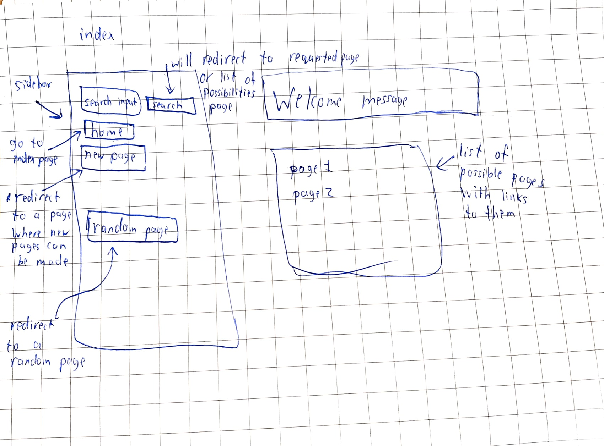
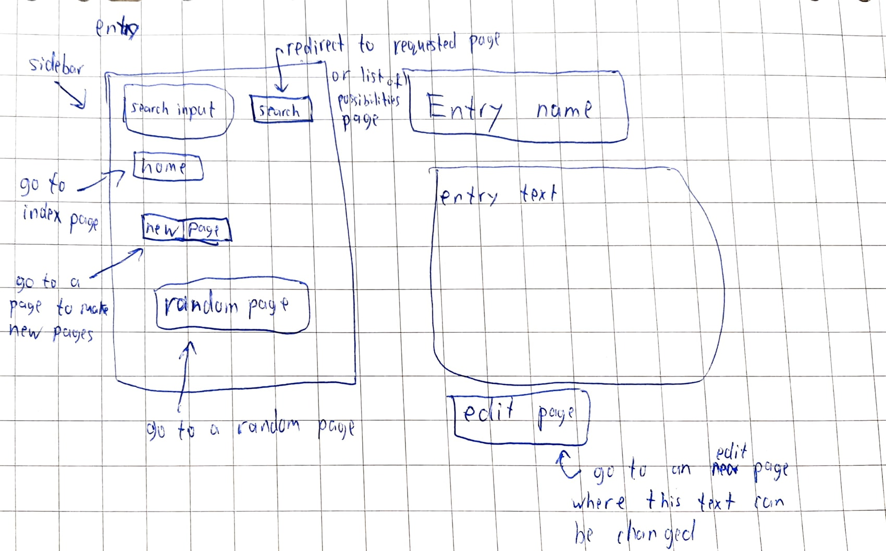
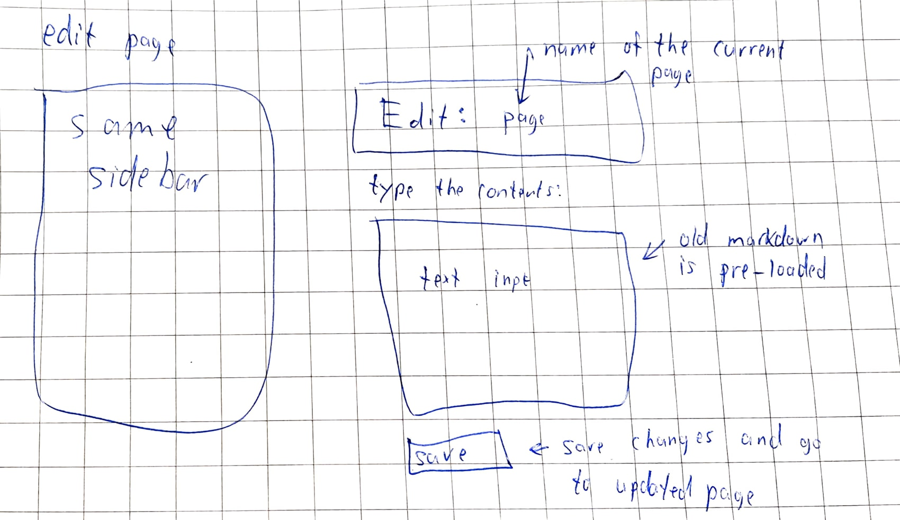
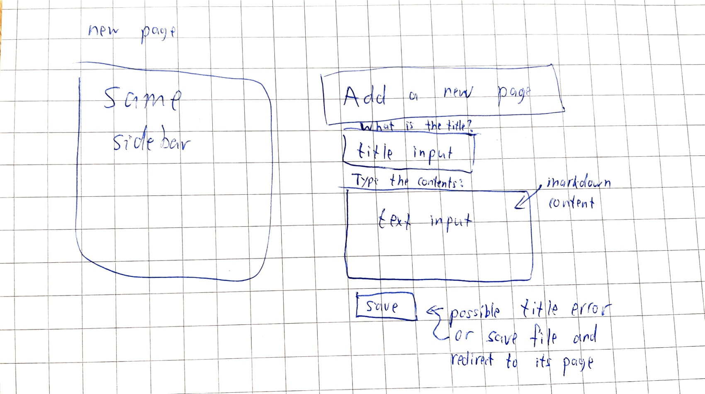
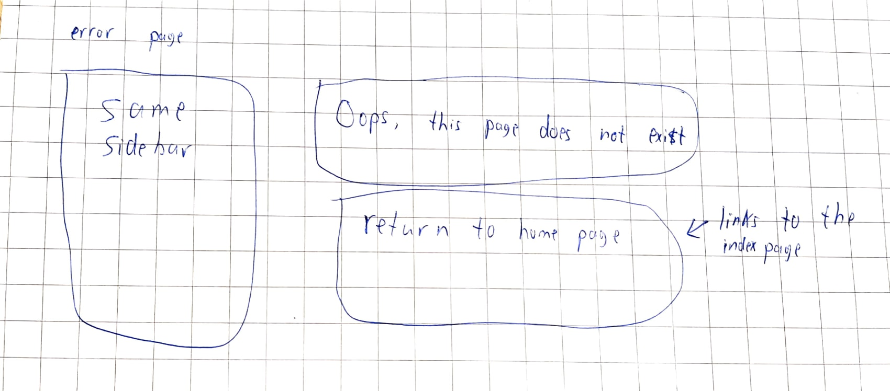
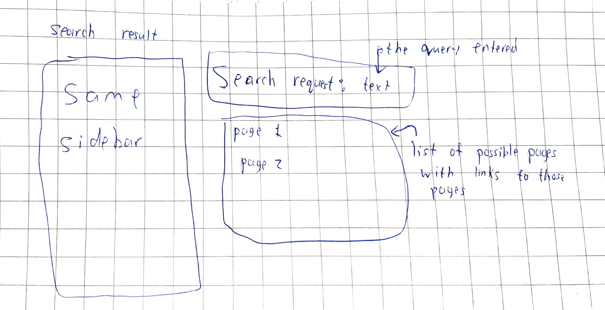
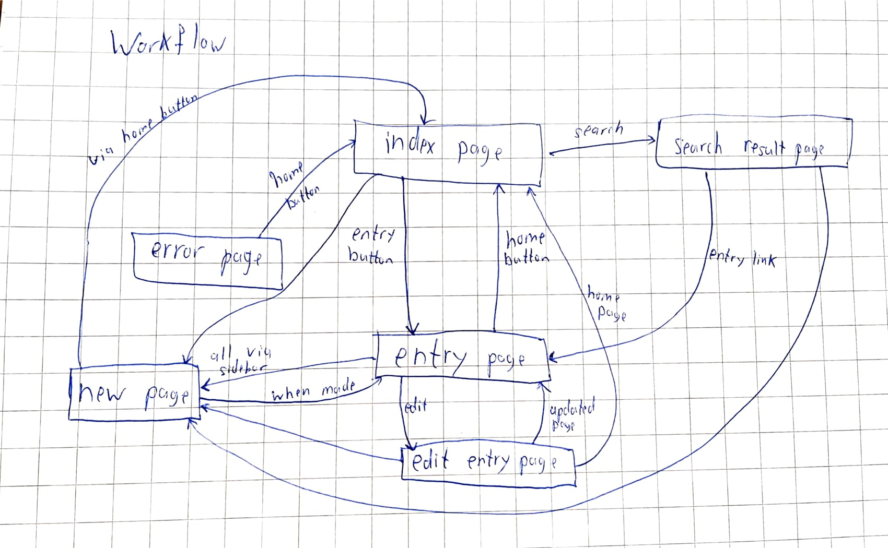

# Wiki

Made by Lars Disberg \
For the minor programmeren

Wiki is an online encyclopedia made with Django package for python. People can see, edit and add pages that contain information about numerous things.

## Getting Started

This project requires a user to have python3 installed with the Django module. Django allows its users so setup a website and allows the user to run this project as a local server. Then the user can add/edit/view different pages of the encyclopedia.

## Project requirements

When starting the app, users are send to the index page. Here is a sketch for the index page:

Then users can go to an entry page by clicking on a link to that page:

These pages can be edited on an edit page:

New pages can be added through the add new page:

When navigating to a non-existing page, an error page is shown:

When entering a search term, the user goes to a search result page:

The workflow is as follows:
